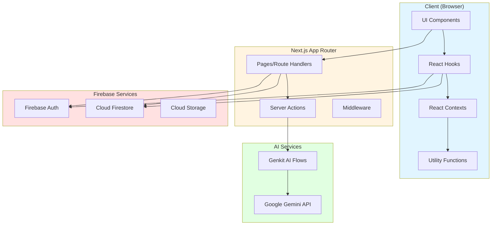
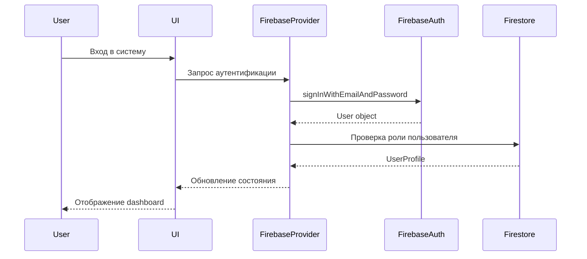
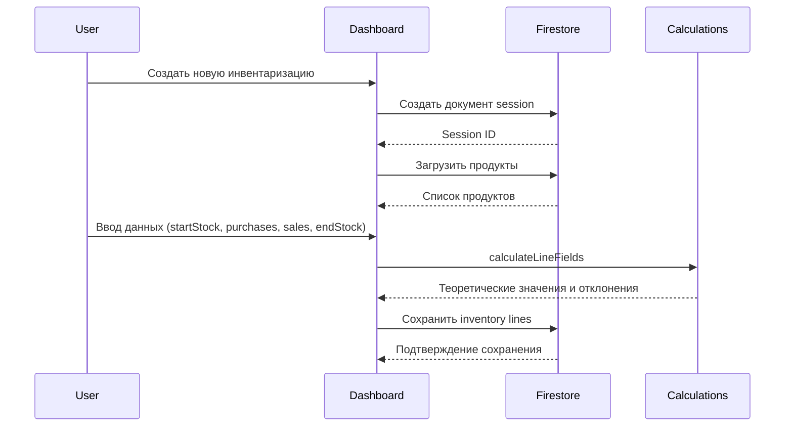
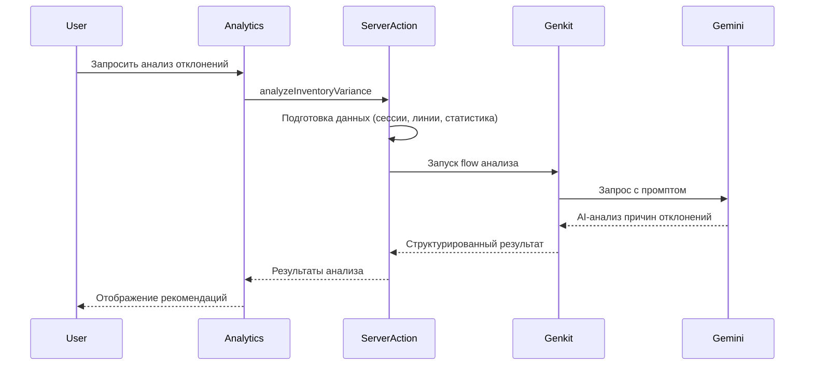

# Архитектура BarBoss Inventory Management

## Обзор системы

BarBoss - это веб-приложение для управления инвентаризацией баров и ресторанов, построенное на Next.js 15 с использованием Firebase/Firestore в качестве backend.

## Технологический стек

- **Frontend Framework**: Next.js 15 (App Router)
- **UI Library**: React 19
- **Styling**: Tailwind CSS + Radix UI
- **Backend**: Firebase (Firestore, Authentication)
- **Type Safety**: TypeScript 5
- **Validation**: Zod
- **AI Integration**: Google Gemini (Genkit)
- **Testing**: Jest + React Testing Library

## Архитектурная диаграмма



## Поток данных

### Аутентификация



### Создание инвентаризации



### AI-анализ отклонений



## Структура данных

### Firestore Collections

```
/users/{userId}
  - displayName
  - email
  - role
  - createdAt

/products/{productId}
  - name
  - category
  - costPerBottle
  - bottleVolumeMl
  - ...

/bars/{barId}
  - name
  - ownerUserId
  
  /inventorySessions/{sessionId}
    - name
    - status
    - createdAt
    - closedAt
    
    /lines/{lineId}
      - productId
      - startStock
      - purchases
      - sales
      - endStock
      - theoreticalEndStock
      - differenceVolume
      - differenceMoney
      
  /suppliers/{supplierId}
    - name
    - contactName
    - ...
    
  /purchaseOrders/{orderId}
    - supplierId
    - status
    - orderDate
    
    /lines/{lineId}
      - productId
      - quantity
      - costPerItem
```

## Безопасность

### Firestore Security Rules

- **Path-based ownership**: Каждый пользователь имеет доступ только к своему бару (`bar_{userId}`)
- **Role-based access**: Администраторы имеют расширенные права через коллекцию `roles_admin`
- **Data validation**: Валидация на уровне правил и через Zod схемы

### Аутентификация

- Firebase Authentication для управления пользователями
- JWT токены для сессий
- Защита от несанкционированного доступа через Security Rules

## Производительность

### Оптимизации

1. **Code Splitting**: Динамические импорты для тяжелых компонентов
2. **Caching**: localStorage для кэширования данных
3. **Memoization**: useMemo для дорогих вычислений
4. **Real-time Updates**: onSnapshot для live обновлений
5. **Batch Operations**: Использование writeBatch для множественных операций

### Индексы Firestore

- `inventorySessions`: status + closedAt (desc)
- `inventorySessions`: status + createdAt (desc)
- `purchaseOrders`: orderDate (desc)

## Обработка ошибок

### Стратегия

1. **Error Boundaries**: Перехват ошибок React компонентов
2. **Error Monitor**: Централизованный мониторинг ошибок (Sentry integration)
3. **Graceful Degradation**: Fallback для AI-анализа и других сервисов
4. **User Feedback**: Toast уведомления для пользователя

## Офлайн-режим

### Реализация

- **Offline Manager**: Очередь операций для синхронизации
- **Local Storage**: Кэширование данных для офлайн доступа
- **Sync on Reconnect**: Автоматическая синхронизация при восстановлении соединения

## Тестирование

### Покрытие

- **Unit Tests**: Бизнес-логика (calculations, utils)
- **Integration Tests**: Firestore операции
- **Component Tests**: UI компоненты (планируется расширение)

## Развертывание

### Environment Variables

- Firebase credentials (NEXT_PUBLIC_FIREBASE_*)
- Google GenAI API key (GOOGLE_GENAI_API_KEY)
- Sentry DSN (NEXT_PUBLIC_SENTRY_DSN, опционально)

### Build Process

1. TypeScript compilation
2. Next.js build с оптимизацией
3. Static generation где возможно
4. Deployment на платформу (Firebase Hosting / Vercel)

## Будущие улучшения

- [ ] PWA поддержка
- [ ] Расширенная аналитика
- [ ] Мобильное приложение
- [ ] Мультиязычность (i18n)
- [ ] Расширенное тестирование (E2E)

